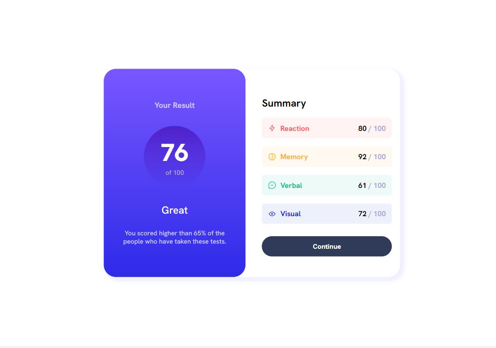
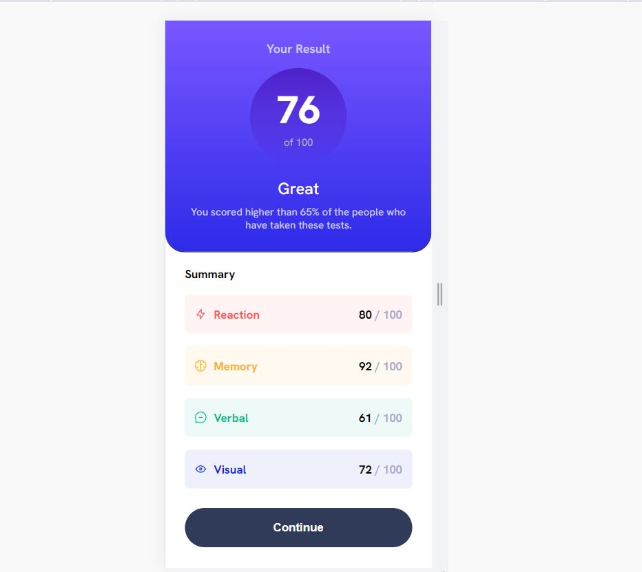

# Frontend Mentor - Results summary component solution

This is a solution to the [Results summary component challenge on Frontend Mentor](https://www.frontendmentor.io/challenges/results-summary-component-CE_K6s0maV). Frontend Mentor challenges help you improve your coding skills by building realistic projects. 

## Table of contents

- [Overview](#overview)
  - [The challenge](#the-challenge)
  - [Screenshot](#screenshot)
  - [Links](#links)
- [My process](#my-process)
  - [Built with](#built-with)
  - [Continued development](#continued-development)
- [Author](#author)

## Overview

### The challenge

Users should be able to:

- View the optimal layout for the interface depending on their device's screen size
- See hover and focus states for all interactive elements on the page

### Screenshot

### Links

- Solution URL: [Solution URL here](https://github.com/danyela2000/results-summary-project/blob/main)
- Live Site URL: [Live site URL here](https://gentle-truffle-5bbd71.netlify.app)

## My process

### Built with
- CSS custom properties
- Flexbox
- Mobile-first workflow

### Continued development
- from mobile first design to desktop design
- customise the css design efficiently
- finish the project faster

## Author
- Frontend Mentor - [@danyela2000](https://www.frontendmentor.io/profile/@danyela2000)

